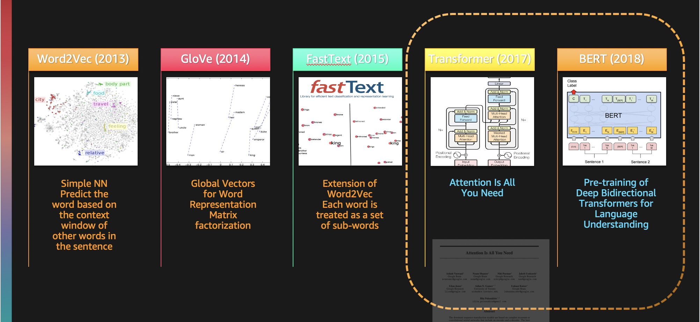

# Solving NLP (Natural Language Processing) Problems with HuggingFace Library on AWS for Turkish Language

**AI Powered NLP Trends**
The decade-old field of natural language processing (NLP) is experiencing a fascinating renaissance, and researchers are finally able to train complex deep learning models on very large text datasets, in order to solve business problems such as question answering, sentence comparison, or text summarization. In this respect, the Transformer deep learning architecture has proven very successful, and has spawned several state of the art model families such as BERT, T5, GPT. As amazing as these models are, training and optimizing them remains a challenging endeavor that requires a significant amount of time, resources, and skills. 

 

**Hugging Face**
Hugging Face, founded in 2016, is a startup that makes it easy to add state of the art Transformer models to your AI/ML applications. Thanks to their popular libraries, one can download and predict with over 7,000 pre-trained models in 164 languages. 
 
**NLP on AWS**
AWS offers the broadest and deepest set of machine learning services and supporting cloud infrastructure, putting machine learning in the hands of every developer, data scientist and expert practitioner. Tens of thousands of customers use Amazon SageMaker, our fully managed service for machine learning.

In this session, we will make a demo on how to fine-tune Hugging Face models on Amazon SageMaker for an NLP task using a public dataset.

# Target Audience
Software developers, solutions architects, product managers with experience in Data Science and Machine Learning for NLP Domain. Knowledge of Transformer Architecture is recommended but not required.

# Prerequisites

You could run the demo on your AWS Account using AWS SageMaker. 

# Use Case & Dataset
In this demo, we will use a Turkish language model created by the MDZ Digital Library team (dbmdz) at the Bavarian State Library (https://github.com/stefan-it/turkish-bert). We will use the Hugging Face Model Hub to download the model (https://huggingface.co/dbmdz/bert-base-turkish-uncased) and then fine-tune it to 2 very different tasks:

## Use Case 1: Sentiment Analysis

**Input Text**: 

Following input text is provided to the model.

> Bu film biraz sıkıcıydı.

**Answer**: 
Following sentiment is predicted:

> Negative (Confidence score: 0.9593140482902527)

## Use Case 2: Question Answering

**Context**: 

Following paragraph is provided to the model.

> ABASIYANIK, Sait Faik. Hikayeci (Adapazarı 23 Kasım 1906-İstanbul 11 Mayıs 1954).
İlk öğrenimine Adapazarı’nda Rehber-i Terakki Mektebi’nde başladı. İki yıl kadar Adapazarı İdadisi’nde okudu.
İstanbul Erkek Lisesi’nde devam ettiği orta öğrenimini Bursa Lisesi’nde tamamladı (1928). İstanbul Edebiyat
Fakültesi’ne iki yıl devam ettikten sonra babasının isteği üzerine iktisat öğrenimi için İsviçre’ye gitti.
Kısa süre sonra iktisat öğrenimini bırakarak Lozan’dan Grenoble’a geçti. Üç yıl başıboş bir edebiyat öğrenimi
gördükten sonra babası tarafından geri çağrıldı (1933). Bir müddet Halıcıoğlu Ermeni Yetim Mektebi'nde Türkçe
gurup dersleri öğretmenliği yaptı. Ticarete atıldıysa da tutunamadı. Bir ay Haber gazetesinde adliye muhabirliği
yaptı (1942). Babasının ölümü üzerine aileden kalan emlakin geliri ile avare bir hayata başladı. Evlenemedi.
Yazları Burgaz adasındaki köşklerinde, kışları Şişli’deki apartmanlarında annesi ile beraber geçen bu fazla
içkili bohem hayatı ömrünün sonuna kadar sürdü.

**Question**: 
Following question is provided to the model:

> Ne zaman avare bir hayata başladı?

**Answer**: 
Following answer is predicted:

> Babasının ölümü üzerine.

# Disclaimer
The work is provided “as is” without warranties or conditions of any kind, either express or implied, including warranties.

Data & brands mentioned in this workshop are obtained from public domain dataset and used solely for education purposes. AWS and the brands are not endorsed.

